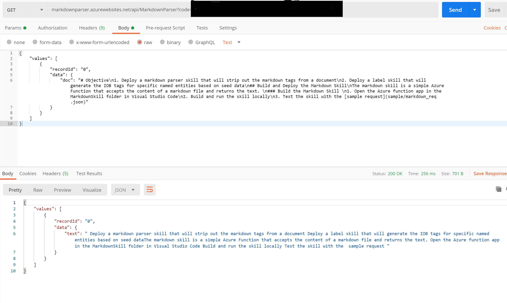
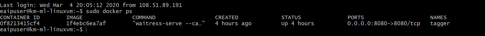
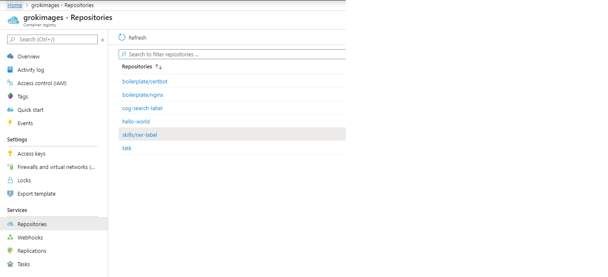
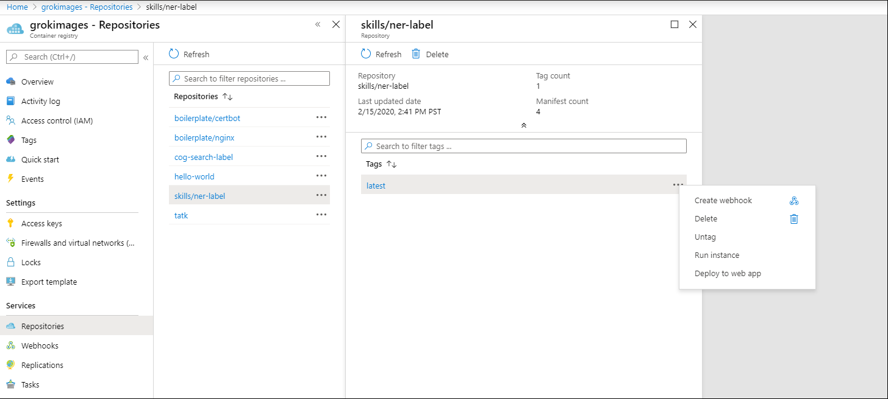
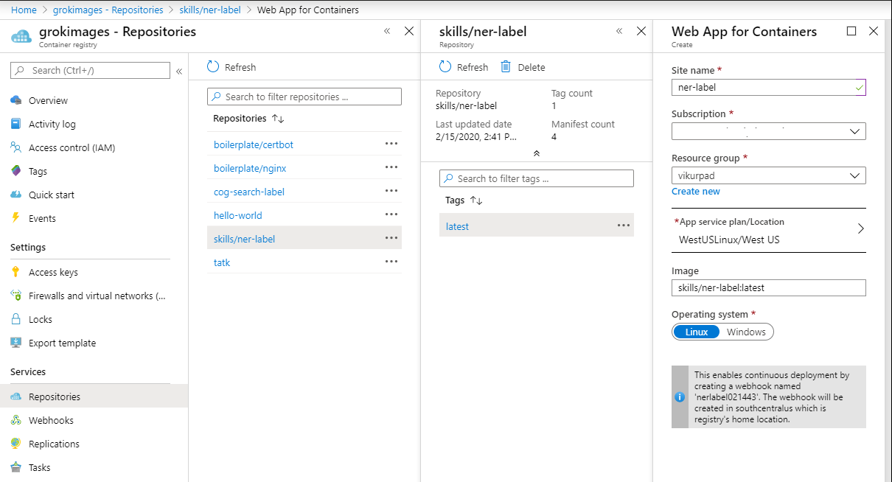

# Objective

1. Deploy a markdown parser skill that will strip out the markdown tags from a document
2. Deploy a label skill that will generate the IOB tags (in CONLL format) for specific named entities based on seed data

## Build and Deploy the Markdown Skill

The markdown skill is a simple Azure Function that accepts the content of a markdown file and returns the text. 

### Build the Markdown Skill
Make sure that you have the required prerequisites as mentioned [here](https://docs.microsoft.com/en-us/azure/developer/python/tutorial-vs-code-serverless-python-01)
1. Open the [markdown_skill](./markdown_skill/) folder in Visual Studio Code
2. VS code will prompt you to Create virtual environment as it Failed to find Python Virtual environment. Click "Create virtual environment" button. You wil then be prompted to Select a Python interpreter to create a virtual environment. Select Python 3.6.x or 3.7.x. Once the virtual environment is created, you will get a message that it finished creating virtual environment.
3. Press F5 to debug locally using Postman. Test the skill with the [sample request](sample/markdown_req.json). You should get a response from the function as shown below:
 

### Deploy the Markdown Skill

1. Deploy the Markdown skill to Azure from Visual Studio Code. Refer to this [link](https://docs.microsoft.com/en-us/azure/developer/python/tutorial-vs-code-serverless-python-05)
2. From Azure portal, go to the MarkdownParser function. Select "</> Get function URL" to get the URL for the function. Save this as this will be used while configuring Cognitive Search.

## Deploy the Label Skill

This section walks you through the process of deploying a skill to label your data for Named Entity Recognition (NER).

The BERT model we create in Step 4 of this accelerator requires the training data to be labeled in the  [CONLL format](http://cs229.stanford.edu/proj2005/KrishnanGanapathy-NamedEntityRecognition.pdf) so we label the data in a way that gives us the IOB tags we need for training.

The label skill takes the text of the document as its input. From there, the skill splits the text into sentences and generates a label and part of speech (POS) for each token in the sentence:

```json
{
    "POS": "JJ",
    "label": "B-Product",
    "token": "Azure"
}
```

You'll notice the inputs and outputs of the skill use the [Custom Skill Interface](https://docs.microsoft.com/en-us/azure/search/cognitive-search-custom-skill-interface) so the skill can be easily integrated with Azure Cognitive Search.

If you want to start with a labeled dataset or already have labeled data, you can skip ahead to [Step 4](../04_Train_and_Deploy/Readme.md).

### Prerequisites

You'll need to have docker installed to run through this folder. You can either [install Docker](https://docs.docker.com/install/) on your local computer or spin up a VM on Azure.

### Build and deploy

> Note: If you're running these commands on Windows, simply drop `sudo` from the beginning of the command.

1. Start by cloning the repo into an environment where you have Docker installed. 
2. Build the **Dockerfile** in this folder using the docker build command. You can replace `km-aml` with your user name or leave it as is:

    ```cmd
    sudo docker build -t km-aml/ner-label .
    ```

3. Run the container locally with the docker run command:

    ```cmd
    sudo docker run -d -p 8080:8080 --name tagger km-aml/ner-label
    ```

4. Test the endpoints on port 8080 by navigating to `http://localhost:8080` in your web browser.
5. List the active containers to get the container id:

    ```cmd
    sudo docker ps
    ```

    The output should look similar to this screenshot:
    

6. Create and tag the image. Replace `11a0e50b8bc4` with the container id from the previous command:

    ```cmd
    sudo docker commit 11a0e50b8bc4 km-aml/ner-label
    ```

7. Create an [Azure Container Registry](https://docs.microsoft.com/en-us/azure/container-registry/container-registry-intro) or get the name of an existing one.
8. Login to your container registry. Replace `myregistry` with the name of your container registry instance. This commmand will ask for your username and password. This information can be retrieved from the access keys tab of your container registry:

    ```cmd
    sudo docker login myregistry.azurecr.io
    ```

9. Create an alias of the image:

    ```cmd
    sudo docker tag km-aml/ner-label myregistry.azurecr.io/skills/ner-label
    ```

10. Push the image to [Azure Container Registry](https://docs.microsoft.com/en-us/azure/container-registry/container-registry-get-started-docker-cli):

    ```cmd
    sudo docker push myregistry.azurecr.io/skills/ner-label
    ```

11. To deploy the container as a webapp, select the container from the Azure container Registry repository:

12. Click on the ellipses of the tag and select the `Deploy to web app` option:

13. On the wepapp deployment blade, fill out the required information to deploy. Note: You need to create Linux App Service Plan to complete this step. 

14. Once the deployment completes your container should be ready to test
15. Test the container by clicking on the URL of the deployed web app, you should see a message `To invoke the skill POST the custom skill request payload to the /label endpoint. To set the custom entities, POST to the /annotations endopoint. For a sample, GET the /annotations.`

### Setup and Use

Now that you have the container deployed, it's time to test the container and edit the list of entities you'd like to extract. We recommend using [Postman] (https://www.postman.com/downloads/) to make the API call

#### Test the Container

Once you have the container deployed, test it with a GET request to `https://{web-app-name}.azurewebsites.net`.

 You should see a message ```To invoke the skill POST the custom skill request payload to the /label endpoint. To set the custom entities, POST to the /annotations endopoint. For a sample, GET the /annotations.```

You can also test your skill using the [TestLabelSkill](01_Test_Label_Skill.ipynb) Notebook.

### Edit entities

By default, the entities in labels.json are what is used to label your data. You can leave these defaults or use your own entities. To change the entities, follow the instructions below:

1. The `/annotations` endpoint is where you set the entities you want to tag in your corpus. GET the `https://{web-app-name}.azurewebsites.net/annotations` endpoint and copy the response.
2. Edit the JSON response to define the custom entities and types you want to label in your dataset.
3. POST the edited JSON to `https://{web-app-name}.azurewebsites.net/annotations`

Now, your skill ready to use the new entities with a valid payload

## Wrap up

1. You now have 2 working endpoints, first for a skill that removes the markdown tags, the second is the label skill that can generate an IOB tagged dataset
2. The skills were deployed differently, specifically to demonstrate how you can use the different services on Azure to build and deploy your skill
3. You updated the skill to identify and label a set of custom entities
4. The next step is to configure an enrichment pipeline to invoke these skills for each document in the data source and then generate a dataset of the labeled data.

## Troubleshooting

If you're having any trouble creating the docker container or you want to make changes to the flask app, we recommend you debug it locally to test your changes.

To run the flask app locally, navigate to this folder and run the following command:

```cmd
python main.py
```

You'll likely need to run the following commands to set up your environment:

```cmd
pip install flask
pip install opencensus.ext.azure
pip install spacy
python -m spacy download en_core_web_sm
```

