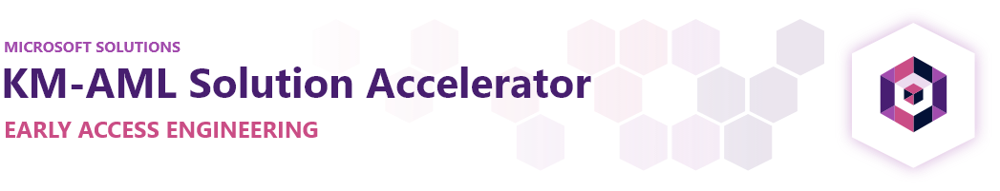

# Knowledge Mining - AzureML Solution Accelerator

## Introduction

This repo walks through the process of creating a knowledge mining solution to enrich your data by identifying custom entities in a corpus of data using an AI custom skill. We'll leverage a number of capabilities in [Azure Cognitive Search](https://azure.microsoft.com/en-us/services/search/) and [Azure Machine Learning](https://azure.microsoft.com/en-us/services/machine-learning/) to extract entities from documents.

The solution will show you how to:

### 1. Create a labeled dataset using your documents (Steps 1-3)

1. Create a custom skill to label data for named entity recognition (NER)
2. Create an enrichment pipeline with Azure Cognitive Search that integrates the label skill to create labelled data from a corpus of documents.
3. Project the labeled data as a new dataset into the Cognitive Search [Knowledge Store](https://docs.microsoft.com/azure/search/knowledge-store-concept-intro) so that it can be used for training.

### 2. Train a BERT NER model (Steps 4-5)

> If you already have labelled data or want to use the sample data provided with this repo, you can skip ahead to Step 4.
4. Use the labeled data to train a Named Entity Recognition (NER) Model in Azure Machine Learning using a [BERT](https://en.wikipedia.org/wiki/BERT_(language_model)) model designed to extract entities from documents. The code used to train the model was derived from the [NLP Recipes Repo](https://github.com/microsoft/nlp-recipes).
5. Integrate the BERT NER custom skill with Azure Cognitive Search to project the identified entities and content of each document into the knowledge store and the search index.

This is designed to be used in conjunction with the [Knowledge Mining Solution Accelerator](https://github.com/Azure-Samples/azure-search-knowledge-mining). After you train and deploy the model, you can easily integrate the model with the solution accelerator to showcase the results in a Web App.

## Prerequisites

The directions provided in this guide assume you have a working understanding of Azure Machine Learning and Azure Cognitive Search. It's important to also understand the concept of [Custom Skills](https://docs.microsoft.com/azure/search/cognitive-search-custom-skill-interface), [Knowledge Store](https://docs.microsoft.com/azure/search/knowledge-store-concept-intro) and [Projections](https://docs.microsoft.com/azure/search/knowledge-store-projection-overview) in Cognitive Search. You'll also need access to an [Azure Subscription](https://azure.microsoft.com/en-us/free/).

## Getting Started

This repo helps you to **(1)** Label data for Named Entity Recognition (NER) and **(2)** Train a model using that labelled data. Steps 1 thru 3 walk you through the process of labelling that data while Steps 4 and 5 walk you through the process of training and deploying the model

> If you already have labelled data or want to use the sample data provided with this repo, you can skip ahead to Step 4.

First, deploy the necessary resources onto Azure:

| Description  | ARM Template  |
|---|---|
|| **Recommended**: Deploy everything|
|| Deploy *Cognitive Search*, *Cognitive Services*, *Container Registry*, and *Azure Machine Learning*
|| Deploy only *Azure Machine Learning*  |

Next, walk through the folders sequentially and follow the steps outlined in each README:

### [01 - Deploy Custom Skils](./01_Deploy_Skills/README.md)

There are two custom skills that will be deployed to generate NER Labeled data from. Deploy a [Custom Skill](https://docs.microsoft.com/en-us/azure/search/cognitive-search-custom-skill-interface) to label data in [CONLL format](http://cs229.stanford.edu/proj2005/KrishnanGanapathy-NamedEntityRecognition.pdf) based on a pre-determined list of entities (see [labels.json](./01_Deploy_Skills/labels.json)). The custom Label skill is created using a Flask API App, wrapped up into a docker container and then deployed onto a [Web App for Containers](https://azure.microsoft.com/en-us/services/app-service/containers/).

### [02 - Setup Cognitive Search to generate NER Labeled data](./02_Setup_Cognitive_Search/README.md)

Walks you through the process of integrating the custom skill with an Azure Cognitive Search index. You'll create the index and project the documents to knowledge store  using a Jupyter Notebook.
Download Sample data to generate NER Label data from SampleData [folder](./SampleData) 

### [03 - Generate Label Data](./03_Generate_Label_Data/README.md)

Aggregate all the sentences from different documents in Knowledge Store into a single document that will be used to train NER ML model

### [04 - Train and Deploy BERT NER Model](./04_Train_and_Deploy/README.md)

Trains a BERT model to extract entities from documents and then deploys the model to an AKS cluster using a custom skill format.

At this point, you'll want to have your Azure Machine Learning Workspace setup so that you can walk through these [instructions](./environment-setup.md) to set up a notebook VM and clone this repo onto it.

### [05 - Integrate BERT NER Model with Cognitive Search](./05_Integrate_with_Cognitive_Search/README.md)

Walks through the process of integrating the AML Skill with the search index and spinning up the user interface. At the end of this step, you'll have a Cognitive Search index containing the entities extracted using your BERT model.